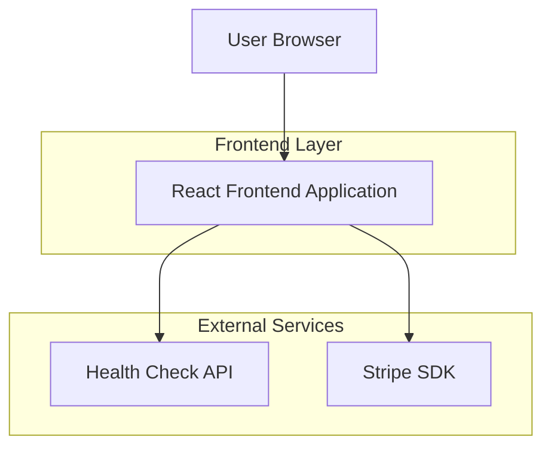

## 1. Architecture design



## 2. Technology Description
- Frontend: React@18 + tailwindcss@3 + vite
- Initialization Tool: vite-init
- Backend: None (client-side only)
- External Services: Stripe SDK, Health Check endpoints

## 3. Route definitions
| Route | Purpose |
|-------|---------|
| / | Dashboard page displaying API health, Stripe config, and payment demo |

## 4. API definitions

### 4.1 Health Check API
```
GET /api/health
```

Response:
| Param Name| Param Type  | Description |
|-----------|-------------|-------------|
| status    | string      | Service status ('healthy' or 'unhealthy') |
| timestamp | string      | ISO timestamp of check |
| services  | object      | Individual service statuses |

Example
```json
{
  "status": "healthy",
  "timestamp": "2025-12-11T10:30:00Z",
  "services": {
    "api": "healthy",
    "database": "healthy"
  }
}
```

### 4.2 Stripe Payment Intent
```
POST /api/create-payment-intent
```

Request:
| Param Name| Param Type  | isRequired  | Description |
|-----------|-------------|-------------|-------------|
| amount    | number      | true        | Payment amount in cents |
| currency  | string      | false       | Currency code (default: 'usd') |

Response:
| Param Name| Param Type  | Description |
|-----------|-------------|-------------|
| clientSecret | string  | Stripe payment intent client secret |
| status    | string      | Payment intent status |

## 5. Server architecture diagram
Not applicable - this is a client-side only application.

## 6. Data model
Not applicable - no persistent data storage required.