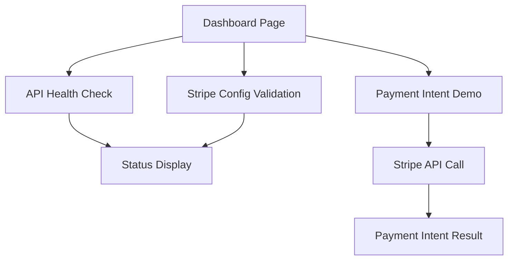

## 1. Product Overview
A minimal frontend dashboard that displays API health status, Stripe configuration status, and provides a Payment Intent demonstration. This tool helps developers quickly verify their API and Stripe integration status.

## 2. Core Features

### 2.1 User Roles
No authentication required - this is a public status dashboard.

### 2.2 Feature Module
Our API health and Stripe demo consists of the following main page:
1. **Dashboard page**: API health indicators, Stripe config status, payment intent demo form.

### 2.3 Page Details
| Page Name | Module Name | Feature description |
|-----------|-------------|---------------------|
| Dashboard | API Health Monitor | Display real-time status of configured APIs with color-coded indicators (green/red). |
| Dashboard | Stripe Config Status | Show Stripe API key validation and configuration completeness status. |
| Dashboard | Payment Intent Demo | Simple form to create test payment intent with amount input and create button. |

## 3. Core Process
Users land on the dashboard page and immediately see:
- API health status indicators for configured endpoints
- Stripe configuration validation status
- Interactive payment intent creation form

## 4. User Interface Design

### 4.1 Design Style
- Primary color: Blue (#3B82F6) for healthy status
- Secondary color: Red (#EF4444) for errors
- Neutral color: Gray (#6B7280) for unknown/loading states
- Clean, card-based layout with rounded corners
- System fonts with 16px base size
- Simple status badges and progress indicators

### 4.2 Page Design Overview
| Page Name | Module Name | UI Elements |
|-----------|-------------|-------------|
| Dashboard | API Health Monitor | Card layout with status badges, refresh button, last checked timestamp. |
| Dashboard | Stripe Config Status | Configuration checklist with checkmarks, API key validation indicator. |
| Dashboard | Payment Intent Demo | Input field for amount, create button, result display area. |

### 4.3 Responsiveness
Desktop-first design with mobile-responsive layout. Cards stack vertically on mobile devices.