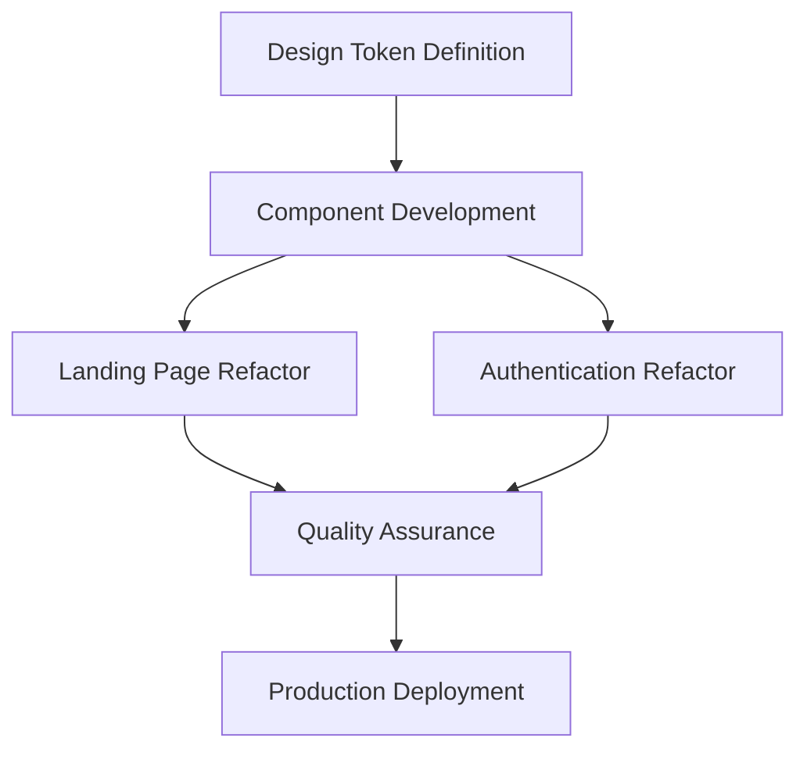

## 1. Product Overview
Adopt HeroUI v3 visual design system to create a consistent, modern UI across the application. This involves implementing design tokens, reusable components, and refactoring existing landing and authentication interfaces to match the clean, minimalist aesthetic with rounded corners, soft shadows, and sans-serif typography.

The product will establish a unified design language that improves user experience through visual consistency while maintaining accessibility and responsiveness across all platforms.

## 2. Core Features

### 2.1 User Roles
No specific user roles required for design system implementation - this is a foundational UI/UX improvement that affects all users uniformly.

### 2.2 Feature Module
The HeroUI v3 design system adoption consists of the following main components:
1. **Design Tokens**: Color palette, typography scale, spacing system, shadow definitions
2. **Component Library**: Buttons, inputs, cards, badges, navigation elements
3. **Landing Page Refactor**: Hero section, feature cards, call-to-action elements
4. **Authentication UI Refactor**: Login forms, registration flows, social auth buttons

### 2.3 Page Details
| Page Name | Module Name | Feature description |
|-----------|-------------|---------------------|
| Design System | Color Tokens | Implement primary/secondary color palette with blue gradients, neutral grays, and semantic colors |
| Design System | Typography | Define font family (sans-serif), size scale, weight hierarchy, and line heights |
| Design System | Spacing System | Establish consistent spacing scale for margins, padding, and component gaps |
| Design System | Shadow System | Implement soft shadow definitions for cards, buttons, and elevated elements |
| Components | Buttons | Create primary, secondary, and social auth buttons with rounded pill styling |
| Components | Form Inputs | Implement text inputs with rounded corners, subtle shadows, and icon support |
| Components | Cards | Design content cards with rounded corners, soft shadows, and proper spacing |
| Components | Badges | Create status badges and version indicators with pill styling |
| Landing Page | Hero Section | Refactor hero area with clean typography, proper spacing, and visual hierarchy |
| Landing Page | Feature Cards | Implement card-based feature showcase with consistent styling |
| Authentication | Login Form | Redesign login interface with rounded inputs and social auth options |
| Authentication | Registration Form | Create registration flow matching the design system aesthetics |

## 3. Core Process
The design system implementation follows a systematic approach:

1. **Design Token Definition**: Establish the foundational design variables
2. **Component Development**: Build reusable UI components using the design tokens
3. **Landing Page Refactor**: Update the main landing page to use new components
4. **Authentication Refactor**: Redesign auth interfaces with consistent styling
5. **Quality Assurance**: Ensure accessibility, responsiveness, and cross-browser compatibility

## 4. User Interface Design

### 4.1 Design Style
**Core Elements:**
- **Primary Colors**: Blue gradient sequence (blue → purple → pink → orange → green)
- **Secondary Colors**: Neutral grays for text and backgrounds
- **Button Style**: Rounded pill buttons with subtle shadows
- **Typography**: Clean sans-serif font family with hierarchical sizing
- **Layout Style**: Card-based design with generous whitespace
- **Icon Style**: Minimalist line icons with consistent stroke weight

**Visual Characteristics:**
- Rounded corners on all interactive elements (8-12px radius)
- Soft shadows for depth and elevation
- Ample whitespace for breathing room
- Left-aligned content with clear visual hierarchy

### 4.2 Page Design Overview
| Page Name | Module Name | UI Elements |
|-----------|-------------|-------------|
| Landing Page | Hero Section | Large sans-serif heading, left-aligned layout, subtle version badge with "New" indicator, generous whitespace |
| Landing Page | Feature Cards | Rounded white cards with soft shadows, medium gray titles, small gray captions with colored status dots |
| Authentication | Login Form | Rounded white input fields with mail icons, "Continue with Google" pill button with multicolor G icon, required field indicators |
| Components | Buttons | White rounded pill buttons with subtle shadows, gray text, consistent hover states |
| Components | Cards | White background, rounded corners (12px), soft shadow, proper padding (16-24px) |
| Components | Badges | Small rounded pills, blue background with white text for "New" indicators |

### 4.3 Responsiveness
- **Desktop-first approach**: Design for desktop screens initially
- **Mobile adaptation**: Scale down gracefully for tablet and mobile devices
- **Touch optimization**: Ensure adequate touch targets (minimum 44px) for mobile users
- **Flexible layouts**: Use responsive grids that adapt to different screen sizes

### 4.4 Accessibility Requirements
- **Color contrast**: Maintain WCAG 2.1 AA compliance for text readability
- **Focus indicators**: Clear visual focus states for keyboard navigation
- **Screen reader support**: Proper ARIA labels and semantic HTML
- **Keyboard navigation**: All interactive elements accessible via keyboard