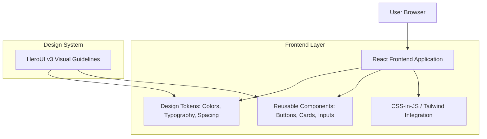

## 1. Architecture Design



## 2. Technology Description

**Core Technologies:**
- **Frontend**: React@18 + Tailwind CSS@3 + Vite
- **Initialization Tool**: vite-init
- **Styling Approach**: Tailwind CSS with custom design tokens
- **Component Architecture**: Atomic design with reusable components
- **Backend**: None (design system implementation only)

**Key Dependencies:**
- tailwindcss@3 - Utility-first CSS framework
- @headlessui/react - Accessible UI components
- lucide-react - Icon library for consistent iconography
- clsx - Conditional CSS classes utility

## 3. Route Definitions

| Route | Purpose |
|-------|---------|
| / | Landing page with HeroUI v3 redesigned hero section |
| /login | Authentication page with redesigned login form |
| /register | Registration page with consistent styling |
| /components | Design system showcase and documentation |
| /style-guide | Visual documentation of design tokens and components |

## 4. Design Token Implementation

### 4.1 Color System
```typescript
// Design tokens for colors
export const colors = {
  primary: {
    blue: '#3B82F6',
    purple: '#8B5CF6',
    pink: '#EC4899',
    orange: '#F97316',
    green: '#10B981'
  },
  neutral: {
    50: '#FAFAFA',
    100: '#F5F5F5',
    200: '#E5E5E5',
    300: '#D4D4D4',
    400: '#A3A3A3',
    500: '#737373',
    600: '#525252',
    700: '#404040',
    800: '#262626',
    900: '#171717'
  },
  semantic: {
    success: '#10B981',
    warning: '#F59E0B',
    error: '#EF4444',
    info: '#3B82F6'
  }
}
```

### 4.2 Typography Scale
```typescript
// Typography tokens
export const typography = {
  fontFamily: {
    sans: ['Inter', 'system-ui', 'sans-serif'],
  },
  fontSize: {
    xs: '0.75rem',    // 12px
    sm: '0.875rem',   // 14px
    base: '1rem',     // 16px
    lg: '1.125rem',   // 18px
    xl: '1.25rem',    // 20px
    '2xl': '1.5rem',  // 24px
    '3xl': '1.875rem', // 30px
    '4xl': '2.25rem',  // 36px
  },
  fontWeight: {
    normal: '400',
    medium: '500',
    semibold: '600',
    bold: '700'
  },
  lineHeight: {
    tight: '1.25',
    normal: '1.5',
    relaxed: '1.75'
  }
}
```

### 4.3 Spacing System
```typescript
// Spacing tokens
export const spacing = {
  0: '0',
  1: '0.25rem',   // 4px
  2: '0.5rem',    // 8px
  3: '0.75rem',   // 12px
  4: '1rem',      // 16px
  5: '1.25rem',   // 20px
  6: '1.5rem',    // 24px
  8: '2rem',      // 32px
  10: '2.5rem',   // 40px
  12: '3rem',     // 48px
  16: '4rem',     // 64px
  20: '5rem',     // 80px
  24: '6rem'      // 96px
}
```

## 5. Component Architecture

### 5.1 Button Components
```typescript
interface ButtonProps {
  variant: 'primary' | 'secondary' | 'google' | 'ghost'
  size: 'sm' | 'md' | 'lg'
  rounded: 'sm' | 'md' | 'lg' | 'full'
  shadow: 'none' | 'sm' | 'md'
  children: React.ReactNode
  onClick?: () => void
  disabled?: boolean
  loading?: boolean
}
```

### 5.2 Card Components
```typescript
interface CardProps {
  variant: 'default' | 'elevated' | 'outlined'
  padding: 'sm' | 'md' | 'lg'
  rounded: 'sm' | 'md' | 'lg'
  shadow: 'none' | 'sm' | 'md' | 'lg'
  title?: string
  subtitle?: string
  children: React.ReactNode
  className?: string
}
```

### 5.3 Form Input Components
```typescript
interface InputProps {
  type: 'text' | 'email' | 'password' | 'number'
  placeholder: string
  label?: string
  required?: boolean
  icon?: React.ReactNode
  rounded: 'sm' | 'md' | 'lg'
  shadow: 'none' | 'sm' | 'md'
  error?: string
  value: string
  onChange: (value: string) => void
}
```

## 6. Tailwind CSS Configuration

```javascript
// tailwind.config.js
module.exports = {
  content: ['./src/**/*.{js,jsx,ts,tsx}'],
  theme: {
    extend: {
      colors: {
        primary: {
          blue: '#3B82F6',
          purple: '#8B5CF6',
          pink: '#EC4899',
          orange: '#F97316',
          green: '#10B981'
        },
        neutral: {
          50: '#FAFAFA',
          100: '#F5F5F5',
          200: '#E5E5E5',
          300: '#D4D4D4',
          400: '#A3A3A3',
          500: '#737373',
          600: '#525252',
          700: '#404040',
          800: '#262626',
          900: '#171717'
        }
      },
      borderRadius: {
        'sm': '0.375rem',   // 6px
        'md': '0.5rem',     // 8px
        'lg': '0.75rem',    // 12px
        'xl': '1rem',       // 16px
        '2xl': '1.5rem',    // 24px
        '3xl': '1.75rem',   // 28px
        'full': '9999px'
      },
      boxShadow: {
        'sm': '0 1px 2px 0 rgba(0, 0, 0, 0.05)',
        'md': '0 4px 6px -1px rgba(0, 0, 0, 0.1), 0 2px 4px -1px rgba(0, 0, 0, 0.06)',
        'lg': '0 10px 15px -3px rgba(0, 0, 0, 0.1), 0 4px 6px -2px rgba(0, 0, 0, 0.05)'
      },
      fontFamily: {
        'sans': ['Inter', 'system-ui', 'sans-serif']
      }
    }
  },
  plugins: []
}
```

## 7. Implementation Strategy

### 7.1 Phase 1: Foundation
- Set up Tailwind CSS configuration
- Define design tokens (colors, typography, spacing)
- Create base component structure

### 7.2 Phase 2: Core Components
- Implement Button component variants
- Build Card components with elevation levels
- Create Form Input components with validation states
- Develop Badge and status indicator components

### 7.3 Phase 3: Page Refactoring
- Refactor landing page hero section
- Redesign authentication forms
- Update navigation elements
- Implement consistent spacing and typography

### 7.4 Phase 4: Documentation
- Create component showcase page
- Document design token usage
- Build style guide reference
- Establish component usage guidelines

## 8. Performance Considerations

- **Bundle Size**: Use tree-shaking to minimize CSS bundle size
- **Component Lazy Loading**: Implement code splitting for component library
- **CSS Optimization**: Purge unused styles in production builds
- **Image Optimization**: Use modern image formats and lazy loading
- **Accessibility**: Ensure WCAG 2.1 AA compliance across all components