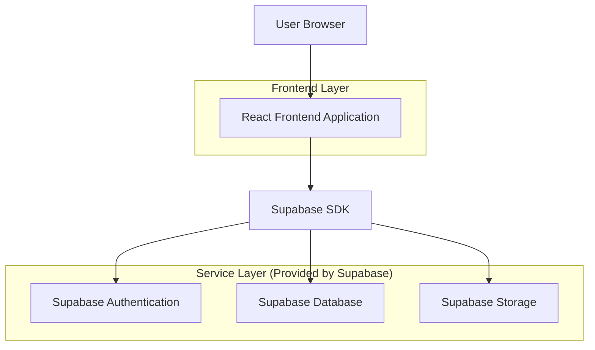
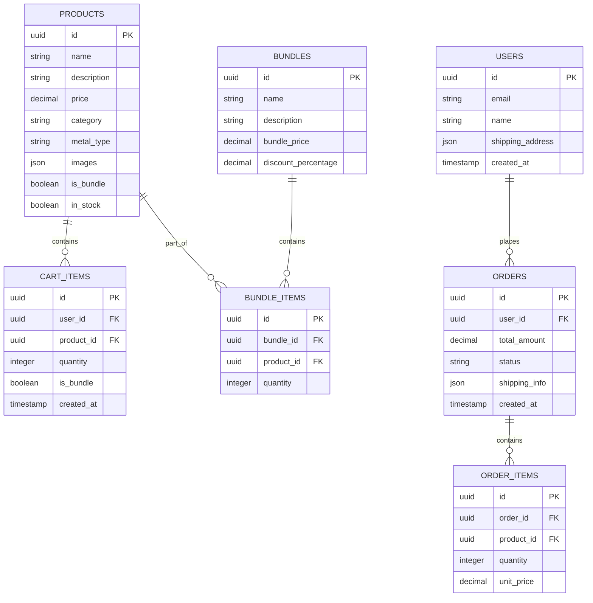

## 1. Architecture design



## 2. Technology Description
- Frontend: React@18 + tailwindcss@3 + vite
- Initialization Tool: vite-init
- Backend: Supabase (Authentication, Database, Storage)
- Payment Processing: Stripe integration

## 3. Route definitions
| Route | Purpose |
|-------|---------|
| / | Home page with hero banner and featured collections |
| /catalog | Product catalog with filtering and search |
| /product/:id | Individual product detail page |
| /cart | Shopping cart with item management |
| /checkout | Checkout process with payment |
| /order-confirmation | Order success confirmation |

## 4. API definitions

### 4.1 Product Management
```
GET /api/products
```

Request:
| Param Name| Param Type  | isRequired  | Description |
|-----------|-------------|-------------|-------------|
| category  | string      | false       | Filter by jewelry category |
| price_min | number      | false       | Minimum price filter |
| price_max | number      | false       | Maximum price filter |
| search    | string      | false       | Search term |

Response:
| Param Name| Param Type  | Description |
|-----------|-------------|-------------|
| products  | array       | Array of product objects |
| total     | number      | Total product count |

### 4.2 Cart Management
```
POST /api/cart/add
```

Request:
| Param Name| Param Type  | isRequired  | Description |
|-----------|-------------|-------------|-------------|
| product_id| string      | true        | Product identifier |
| quantity  | number      | true        | Item quantity |
| bundle_id | string      | false       | Bundle identifier if applicable |

## 5. Data model

### 5.1 Data model definition


### 5.2 Data Definition Language

Products Table
```sql
CREATE TABLE products (
  id UUID PRIMARY KEY DEFAULT gen_random_uuid(),
  name VARCHAR(255) NOT NULL,
  description TEXT,
  price DECIMAL(10,2) NOT NULL,
  category VARCHAR(50) NOT NULL,
  metal_type VARCHAR(50),
  images JSONB,
  is_bundle BOOLEAN DEFAULT false,
  in_stock BOOLEAN DEFAULT true,
  created_at TIMESTAMP WITH TIME ZONE DEFAULT NOW()
);

CREATE INDEX idx_products_category ON products(category);
CREATE INDEX idx_products_price ON products(price);
```

Bundles Table
```sql
CREATE TABLE bundles (
  id UUID PRIMARY KEY DEFAULT gen_random_uuid(),
  name VARCHAR(255) NOT NULL,
  description TEXT,
  bundle_price DECIMAL(10,2) NOT NULL,
  discount_percentage DECIMAL(5,2) DEFAULT 0,
  created_at TIMESTAMP WITH TIME ZONE DEFAULT NOW()
);
```

Cart Items Table
```sql
CREATE TABLE cart_items (
  id UUID PRIMARY KEY DEFAULT gen_random_uuid(),
  user_id UUID REFERENCES auth.users(id) ON DELETE CASCADE,
  product_id UUID REFERENCES products(id) ON DELETE CASCADE,
  quantity INTEGER DEFAULT 1,
  is_bundle BOOLEAN DEFAULT false,
  created_at TIMESTAMP WITH TIME ZONE DEFAULT NOW()
);

CREATE INDEX idx_cart_items_user_id ON cart_items(user_id);
```

Orders Table
```sql
CREATE TABLE orders (
  id UUID PRIMARY KEY DEFAULT gen_random_uuid(),
  user_id UUID REFERENCES auth.users(id) ON DELETE CASCADE,
  total_amount DECIMAL(10,2) NOT NULL,
  status VARCHAR(50) DEFAULT 'pending',
  shipping_info JSONB,
  created_at TIMESTAMP WITH TIME ZONE DEFAULT NOW()
);

CREATE INDEX idx_orders_user_id ON orders(user_id);
CREATE INDEX idx_orders_status ON orders(status);
```

-- Grant permissions
GRANT SELECT ON products TO anon;
GRANT ALL ON products TO authenticated;
GRANT SELECT ON bundles TO anon;
GRANT ALL ON bundles TO authenticated;
GRANT ALL ON cart_items TO authenticated;
GRANT ALL ON orders TO authenticated;