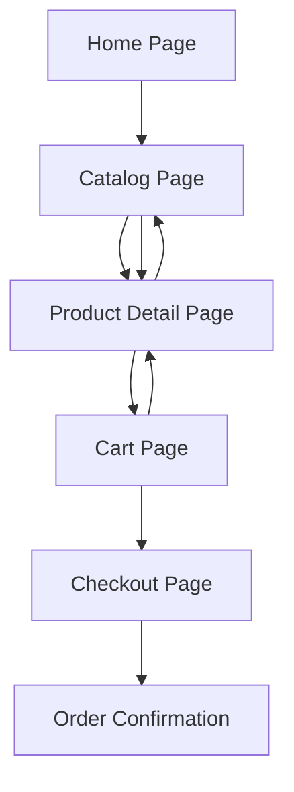

## 1. Product Overview
A jewelry e-commerce website selling individual pieces and curated bundles. Customers can browse collections, view detailed product information, add items to cart, and complete purchases securely.
- Target market: Jewelry enthusiasts seeking quality pieces and gift bundles
- Value proposition: Premium jewelry with bundle discounts and seamless shopping experience

## 2. Core Features

### 2.1 User Roles
| Role | Registration Method | Core Permissions |
|------|---------------------|------------------|
| Guest User | No registration required | Browse products, add to cart |
| Registered User | Email registration | Complete purchases, view order history, save favorites |

### 2.2 Feature Module
Our jewelry e-commerce website consists of the following main pages:
1. **Home page**: Hero banner, featured collections, navigation menu
2. **Catalog page**: Product grid, filtering options, category navigation
3. **Product detail page**: Product images, specifications, pricing, add to cart
4. **Cart page**: Item summary, quantity adjustment, bundle discounts
5. **Checkout page**: Shipping info, payment processing, order confirmation

### 2.3 Page Details
| Page Name | Module Name | Feature description |
|-----------|-------------|---------------------|
| Home page | Hero banner | Display rotating featured jewelry pieces with call-to-action buttons |
| Home page | Featured collections | Showcase popular individual items and bundle deals |
| Home page | Navigation menu | Access to catalog, cart, and account pages |
| Catalog page | Product grid | Display jewelry items in responsive grid layout with images and prices |
| Catalog page | Filter sidebar | Filter by category (rings, necklaces, earrings, bundles), price range, metal type |
| Catalog page | Search functionality | Search products by name or description |
| Product detail page | Image gallery | Multiple product images with zoom capability |
| Product detail page | Product information | Display name, price, materials, sizing, availability |
| Product detail page | Add to cart | Select quantity and add individual items or bundles to cart |
| Product detail page | Bundle options | Show related items that can be purchased together at discount |
| Cart page | Item summary | List all items with images, prices, quantities |
| Cart page | Quantity adjustment | Update item quantities or remove items |
| Cart page | Bundle discount calculation | Automatically apply discounts for qualifying bundles |
| Cart page | Order total | Calculate subtotal, shipping, taxes, and final total |
| Checkout page | Shipping information | Collect delivery address and contact details |
| Checkout page | Payment processing | Secure payment gateway integration |
| Checkout page | Order confirmation | Display order number and confirmation details |

## 3. Core Process
**Customer Shopping Flow:**
1. Customer lands on homepage and browses featured collections
2. Customer navigates to catalog to explore jewelry options
3. Customer filters products by category, price, or metal type
4. Customer clicks on individual product to view details and images
5. Customer selects quantity and adds item to cart
6. Customer continues shopping or proceeds to cart
7. Customer reviews cart contents and applies bundle discounts
8. Customer proceeds to checkout with shipping and payment information
9. Customer receives order confirmation with tracking details

## 4. User Interface Design

### 4.1 Design Style
- **Primary colors**: Gold (#FFD700), White (#FFFFFF), Charcoal (#36454F)
- **Secondary colors**: Rose gold (#E8B4B8), Silver (#C0C0C0)
- **Button style**: Rounded corners with subtle shadows, gold accent on hover
- **Font**: Elegant serif for headings, clean sans-serif for body text
- **Layout style**: Card-based product display with generous white space
- **Icons**: Minimal line icons with jewelry-inspired motifs

### 4.2 Page Design Overview
| Page Name | Module Name | UI Elements |
|-----------|-------------|-------------|
| Home page | Hero banner | Full-width carousel with high-quality jewelry photography, elegant typography overlay |
| Catalog page | Product grid | 3-column responsive grid on desktop, 1-column on mobile, white background with subtle hover effects |
| Product detail page | Image gallery | Left-aligned large image with thumbnail strip below, zoom on hover functionality |
| Cart page | Item summary | Clean card layout with product images, quantity selectors, and prominent total display |
| Checkout page | Form sections | Multi-step form with progress indicator, clear field labels, and secure payment badges |

### 4.3 Responsiveness
- Desktop-first design approach with mobile optimization
- Responsive breakpoints: 768px (tablet), 480px (mobile)
- Touch-friendly interface with larger tap targets on mobile
- Optimized image loading for faster mobile performance