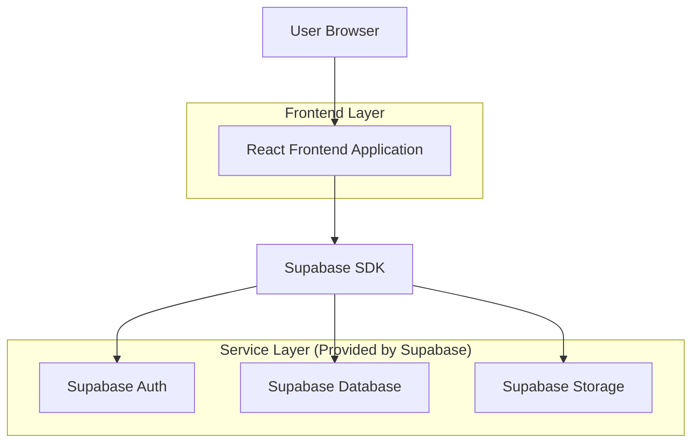
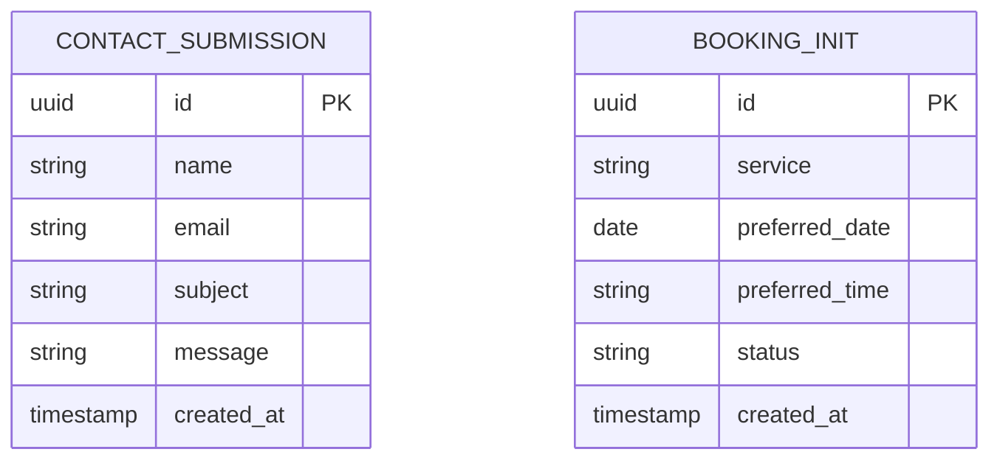

## 1. Architecture design



## 2. Technology Description
- Frontend: React@18 + tailwindcss@3 + vite
- Initialization Tool: vite-init
- Backend: Supabase (Auth, Database, Storage)
- Key Dependencies: @supabase/supabase-js, react-router-dom, lucide-react

## 3. Route definitions
| Route | Purpose |
|-------|---------|
| / | Landing page with hero section and value proposition |
| /pricing | Pricing tiers and feature comparison |
| /contact | Contact form and support information |
| /booking | Booking entry interface stub |

## 4. API definitions
### 4.1 Contact Form API

```
POST /api/contact
```

Request:
| Param Name| Param Type  | isRequired  | Description |
|-----------|-------------|-------------|-------------|
| name      | string      | true        | User's full name |
| email     | string      | true        | Contact email address |
| subject   | string      | true        | Message subject/topic |
| message   | string      | true        | Message content |

Response:
| Param Name| Param Type  | Description |
|-----------|-------------|-------------|
| success   | boolean     | Submission status |
| message   | string      | Confirmation or error message |

Example
```json
{
  "name": "John Doe",
  "email": "john@example.com",
  "subject": "Pricing Question",
  "message": "I'd like to know more about your premium plan."
}
```

### 4.2 Booking Entry API

```
POST /api/booking-init
```

Request:
| Param Name| Param Type  | isRequired  | Description |
|-----------|-------------|-------------|-------------|
| service   | string      | true        | Type of service selected |
| date      | string      | true        | Preferred date (YYYY-MM-DD) |
| time      | string      | true        | Preferred time slot |

Response:
| Param Name| Param Type  | Description |
|-----------|-------------|-------------|
| success   | boolean     | Booking initiation status |
| bookingId | string      | Unique booking identifier |

## 5. Server architecture diagram
Not applicable - Using Supabase backend-as-a-service

## 6. Data model

### 6.1 Data model definition


### 6.2 Data Definition Language
Contact Submissions Table (contact_submissions)
```sql
-- create table
CREATE TABLE contact_submissions (
    id UUID PRIMARY KEY DEFAULT gen_random_uuid(),
    name VARCHAR(255) NOT NULL,
    email VARCHAR(255) NOT NULL,
    subject VARCHAR(255) NOT NULL,
    message TEXT NOT NULL,
    created_at TIMESTAMP WITH TIME ZONE DEFAULT NOW()
);

-- grant permissions
GRANT SELECT ON contact_submissions TO anon;
GRANT INSERT ON contact_submissions TO anon;
```

Booking Initiations Table (booking_initiations)
```sql
-- create table
CREATE TABLE booking_initiations (
    id UUID PRIMARY KEY DEFAULT gen_random_uuid(),
    service VARCHAR(100) NOT NULL,
    preferred_date DATE NOT NULL,
    preferred_time VARCHAR(50) NOT NULL,
    status VARCHAR(20) DEFAULT 'pending' CHECK (status IN ('pending', 'confirmed', 'cancelled')),
    created_at TIMESTAMP WITH TIME ZONE DEFAULT NOW()
);

-- grant permissions
GRANT SELECT ON booking_initiations TO anon;
GRANT INSERT ON booking_initiations TO anon;
```