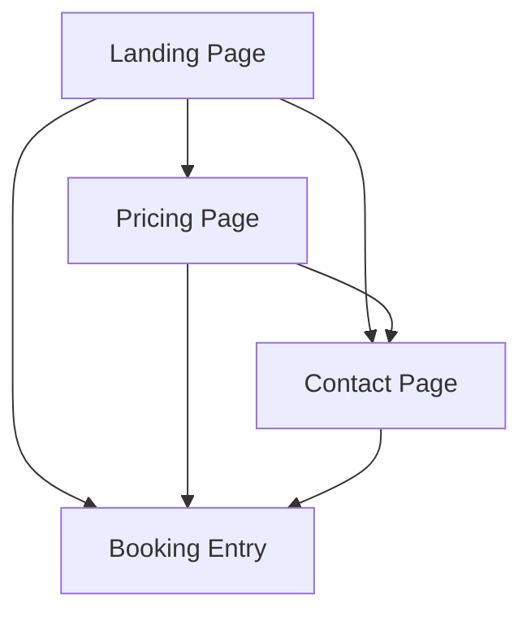

## 1. Product Overview
A public-facing website that serves as the main entry point for users to learn about the service, view pricing, contact support, and access booking functionality.
- Provides essential information and conversion points for potential customers
- Simple, clean design focused on user acquisition and engagement

## 2. Core Features

### 2.2 Feature Module
The user-facing site consists of the following main pages:
1. **Landing page**: Hero section with value proposition, call-to-action buttons, key benefits showcase.
2. **Pricing page**: Pricing tiers, feature comparison, subscription options.
3. **Contact page**: Contact form, support information, business hours.
4. **Booking entry**: Simple booking interface stub to initiate booking process.

### 2.3 Page Details
| Page Name | Module Name | Feature description |
|-----------|-------------|---------------------|
| Landing page | Hero section | Display compelling headline, subheadline, primary CTA button, secondary CTA for booking. |
| Landing page | Benefits showcase | Present 3-4 key value propositions with icons and brief descriptions. |
| Landing page | Navigation | Top navigation bar with logo, menu items for all pages, mobile hamburger menu. |
| Pricing page | Pricing tiers | Display 2-3 pricing plans with features, pricing, and CTA buttons. |
| Pricing page | Feature comparison | Compare features across different plans in a clean table format. |
| Contact page | Contact form | Simple form with name, email, subject, message fields and submit button. |
| Contact page | Contact information | Display email, phone, business hours, and physical address if applicable. |
| Booking entry | Booking stub | Simple interface to start booking process with date/time selection and service type. |
| Global | Footer | Copyright, quick links, social media icons, privacy policy link. |

## 3. Core Process
User flows for the main site:
- **Visitor Flow**: Landing page → Explore pricing → Contact for questions → Start booking
- **Conversion Flow**: Landing page → Direct booking entry → Proceed to full booking system

## 4. User Interface Design
### 4.1 Design Style
- **Primary colors**: Professional blue (#2563eb) with white background
- **Secondary colors**: Light gray (#f3f4f6) for sections, dark gray (#374151) for text
- **Button style**: Rounded corners, clear hover states, primary buttons in blue
- **Font**: Clean sans-serif (Inter or similar), 16px base size
- **Layout style**: Card-based sections, generous whitespace, centered content
- **Icons**: Minimal line icons, consistent style across all pages

### 4.2 Page Design Overview
| Page Name | Module Name | UI Elements |
|-----------|-------------|-------------|
| Landing page | Hero section | Full-width hero with gradient overlay, large headline (48px), subheadline (20px), prominent CTA button (blue with white text), supporting image/illustration. |
| Landing page | Benefits showcase | Three-column grid layout on desktop, stacked on mobile, icon + title + description cards with subtle shadows. |
| Pricing page | Pricing tiers | Card-based pricing boxes, highlight recommended plan, clear pricing display, feature lists with checkmarks. |
| Contact page | Contact form | Clean form layout with proper spacing, input field focus states, clear submit button, success/error message display. |
| Booking entry | Booking stub | Simple card layout with date picker, time slot selection, service type dropdown, proceed button. |

### 4.3 Responsiveness
Desktop-first design approach with mobile adaptation:
- Breakpoints: 768px (tablet), 1024px (desktop)
- Mobile navigation: Hamburger menu with slide-out drawer
- Responsive grids: Single column on mobile, multi-column on desktop
- Touch-optimized: Larger tap targets on mobile devices